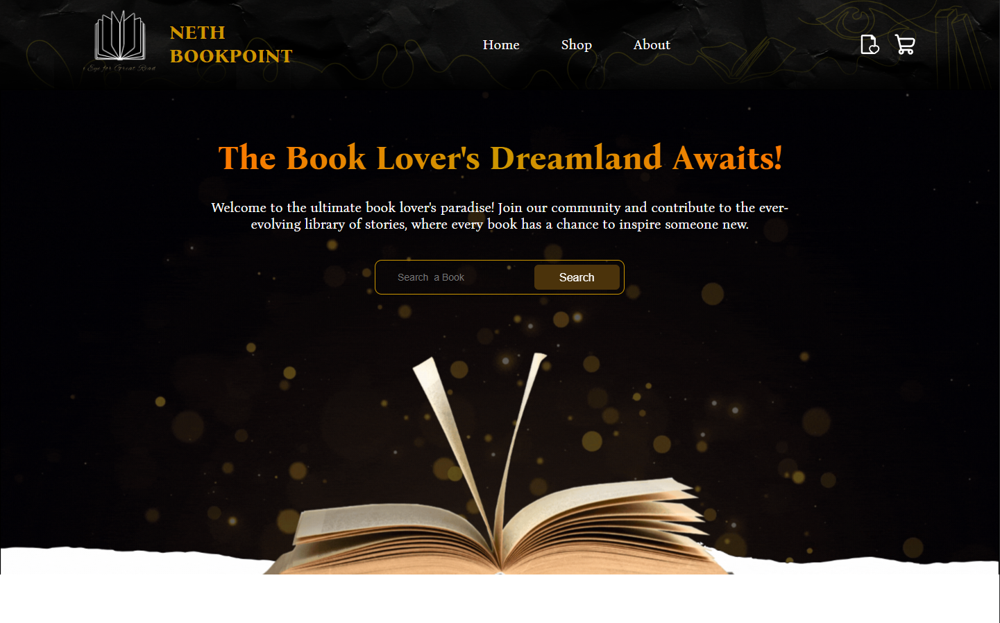
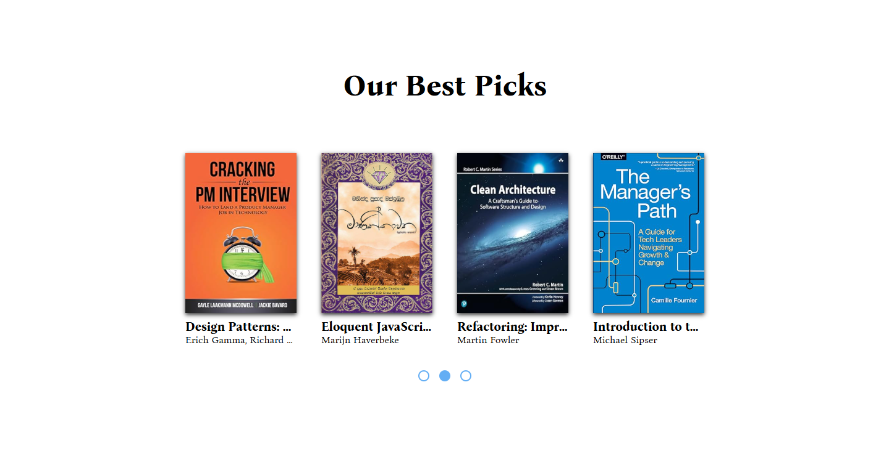
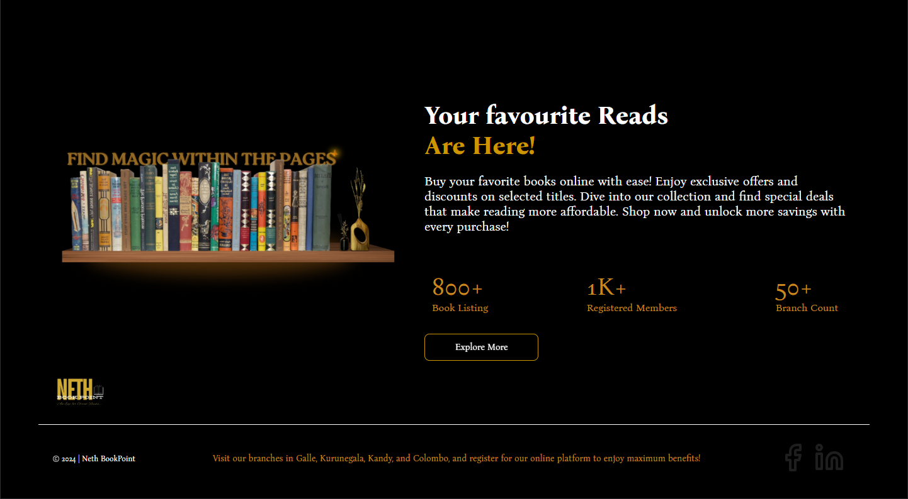
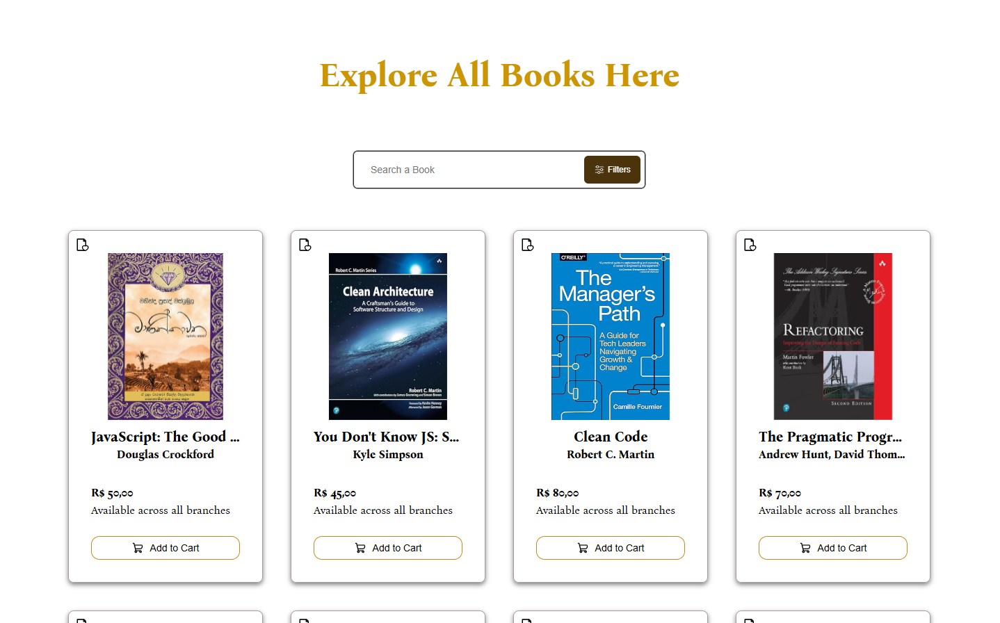
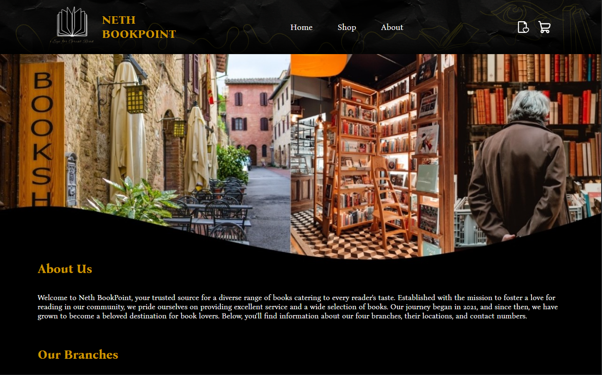
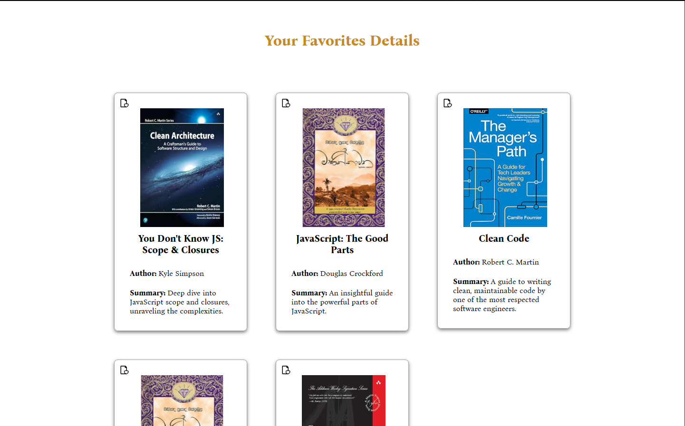
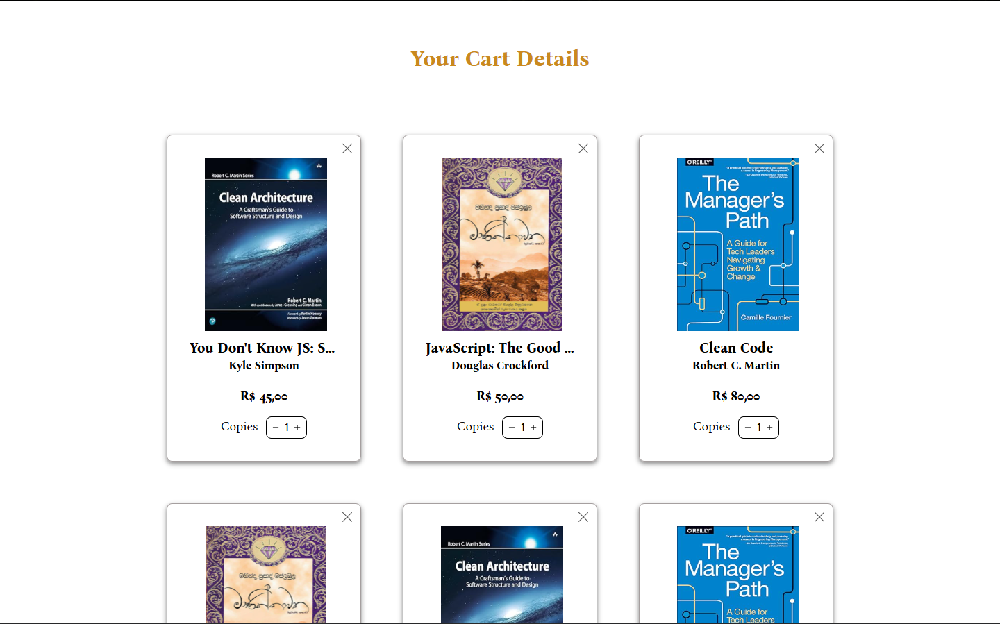
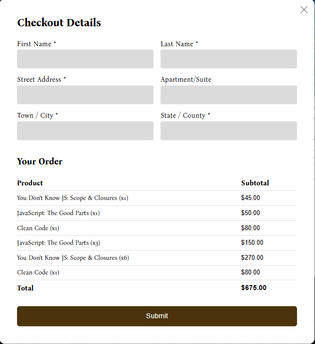

<h1 align="center">Book Store</h1>

<p align="center">
  
  
  
</p>

<br>
<h3 align="center">Página Home da aplicação</h3>


## 💻 Projeto

Este projeto é uma simulação de uma loja de livros online, oferecendo uma experiência completa de navegação, busca e compra de livros.

A página inicial conta com um hero e um botão de busca, que direciona o usuário para a página da loja. Além disso, há uma seção dedicada aos livros mais escolhidos e um footer com links para redes sociais.

Na página da loja, os usuários podem pesquisar livros por nome e utilizar um botão de filtros, que abre um modal com diversas opções para refinar a busca. Cada livro pode ser adicionado ao carrinho ou aos favoritos, com notificações visuais usando React Toastify para melhorar a experiência do usuário.

Ao acessar o carrinho, o usuário encontra uma modal de checkout, onde pode preencher um formulário e visualizar o valor total dos produtos selecionados.

Para a fonte de dados, o projeto utiliza o JSON Server, simulando o consumo de uma API real, com suporte a paginação e filtragem dos livros.

Resoluções suportadas: 1440x900 a 1920x1080.

## 🧪 Tecnologias

Esse projeto foi desenvolvido com as seguintes tecnologias:

-   ReactJS
-   Typescript
-   Css Modules
-   React Hook Form + Zod
-   Json Server

## 🚀 Como executar

Faça o Download/Clone do projeto e para iniciá-lo:

```bash
# Instalar as dependências
$ npm install

# Iniciar o projeto
$ npm run dev
```

<br>
<h3 align="center">Página Home da aplicação</h3>

<br>


<br>
<h3 align="center">Página Shop da aplicação</h3>


<br>
<h3 align="center">Página About da aplicação</h3>


<br>
<h3 align="center">Página Favorites da aplicação</h3>


<br>
<h3 align="center">Página Cart da aplicação</h3>

<br>


## 📝 License

Esse projeto está sob a licença MIT. Veja o arquivo [LICENSE](./LICENSE.md) para mais detalhes.

## 📓 Notes

```bash
➜ npm create vite@latest
    ✔ Select a framework: › React
    ✔ Select a variant: › TypeScript

➜ npm i react-router-dom

➜ npm install json-server

➜ npm install concurrently --save-dev

➜ npm i react-hook-form zod @hookform/resolvers

➜ npm install react-toastify
```
